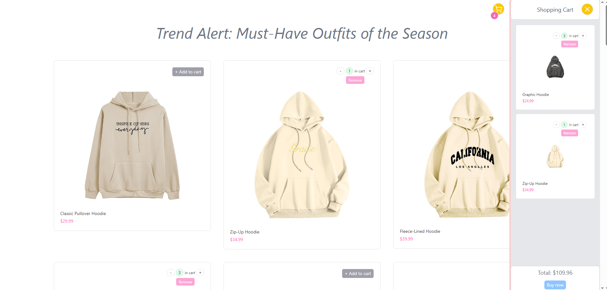

# 🛒 Shopping Cart

An e-commerce application that allows you to browse fashion products and manage your shopping cart. Project built with React and Vite, styled with Tailwind CSS.

## ✨ Features

- 📦 Browse fashion product catalogs
- 🛒 Add and remove products from cart
- 💾 Persistent cart storage (LocalStorage)
- 📱 Responsive design (mobile-first)
- 🎨 Modern interface with Tailwind CSS
- ⚡ Fast loading thanks to Vite

## 🛠️ Technologies

- **React** (v19.1.0) - Library for building user interfaces
- **Vite** (v6.3.5) - Build tool and bundler
- **Tailwind CSS** (v4.1.10) - Utility-first CSS framework
- **Lucide React** - Set of SVG icons
- **Context API** - Application state management
- **ESLint** - Code linting

## 📁 Project Structure

```
shopping-cart/
├── src/
│   ├── components/          # React components
│   │   ├── CartButtons.jsx  # Cart buttons
│   │   ├── CartItem.jsx     # Individual product item
│   │   └── ShoppingCart.jsx # Shopping cart component
│   ├── context/             # Context API
│   │   ├── cartContext.jsx  # Cart context
│   │   └── useCart.js       # Custom hook for cart management
│   ├── utility/             # Helper functions
│   ├── assets/              # Images and static assets
│   ├── App.jsx              # Main application component
│   ├── main.jsx             # Application entry point
│   └── index.css            # Global styles
├── public/                  # Static files
├── index.html               # HTML template
├── vite.config.js           # Vite configuration
├── package.json             # Project dependencies
├── eslint.config.js         # ESLint configuration
└── README.md                # Project documentation
```

## 🎯 Functionality

### Cart Management
- **Add Products** - Click the "Add to Cart" buttons
- **Remove Products** - Remove items directly from the cart
- **Persistence** - Cart is saved in LocalStorage
- **Summary** - Display total number of items and total value

## Webpage

You can visit my app [here](https://shopping-cart-react-context.netlify.app/).

## Screenshots


